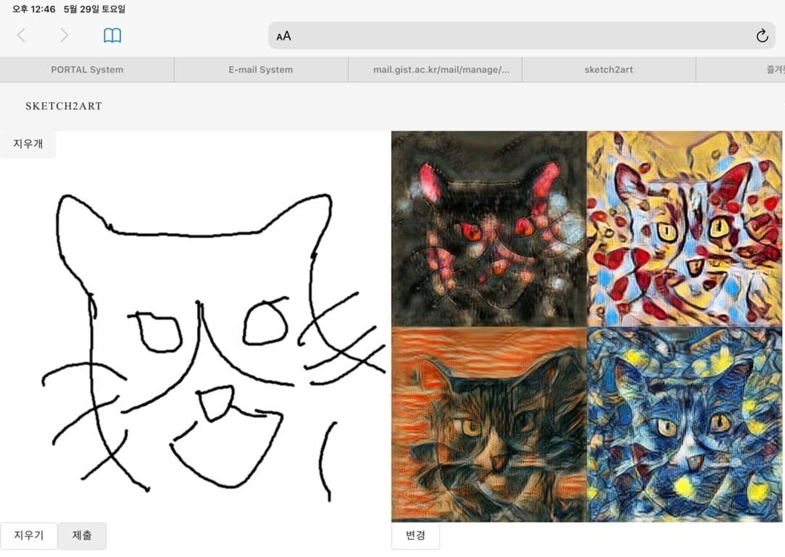

# Sketch2Art Work in Progress
2021-1 "Art&Tech" class, GIST  
hxngiee.github.io/2021-04-21-sketch2art  




<!-- 
## Problem definition


## Dataset

```
1. To get enough sketch data use DeepLab3+ for data preprocessing
pix2pix used 50,000 train data for good performance
```
- Domain A : Sketch dataset (landscape image with canny edge detection)
- Domain B : painting dataset(WikiArt dataset)
-->


## Project I
Additional Module to Pix2Pix model
- Add `Sketch2Art Module` to Pix2Pix model
- Add `Pytorch DDP(DistributedDataParallel) code for Multi GPU Training` to train Sketch2Art model

## Project II
Additional Module to MUNIT model
- Add `Positional Normalization` Module to MUNIT model
- compare FID, LPIPS score
